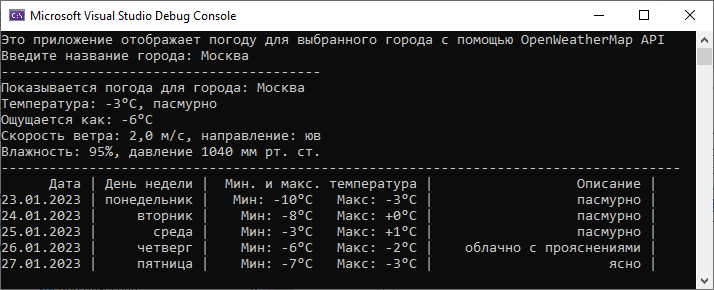

# Exchange Widget

Консольное приложение для просмотра погоды в выбранном городе в текущий момент и прогноз на 5 дней

## Начало работы

Эти инструкции предоставят вам копию проекта и помогут запустить на вашем локальном компьютере для разработки и тестирования.

### Необходимые условия

* Для запуска требуется установить .NET 6
* Зарегистрировать аккаут на [Open Weather Map](https://openweathermap.org/) и получить API Key

### Установка

Собрать решение в Visual Studio 2022 или новее.

### Примеры работы программы

## Авторы

* **Барабанов Илья** - *ведущий разработчик* - [icepow-r](https://github.com/icepow-r/)

